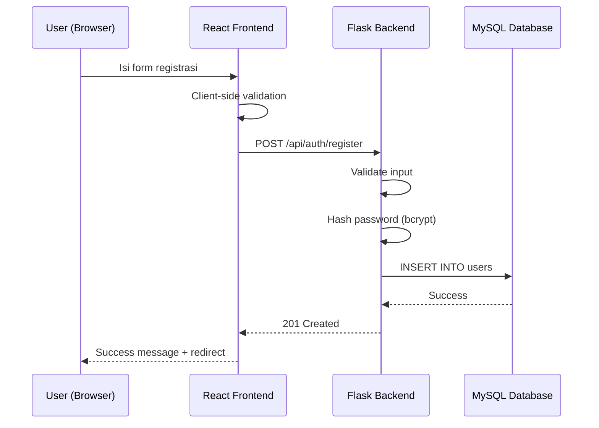

# Halaman Registrasi Sedulur Jiwo — Implementation Plan

## Konteks & Tujuan

Membangun halaman registrasi (Daftar) untuk sistem pakar "Sedulur Jiwo" yang sesuai layout wireframe, dengan peningkatan estetika modern (animated gradient blur background, glassmorphism, micro-animations). Backend akan dibangun ulang menggunakan **Flask (Python)** sesuai permintaan, menggantikan Express.js yang ada di `server/index.js`.

> [!IMPORTANT]
> **Perubahan Backend**: Saat ini project menggunakan Express.js (`server/index.js`). Anda meminta Flask sebagai backend. Saya akan **membuat backend Flask baru** di folder `server/` (Python) dan file Express.js lama akan tetap ada sampai Anda siap menghapusnya. Mohon konfirmasi apakah ini sesuai.

## Open Questions

> [!IMPORTANT]
> 1. **Logo SVG**: Di wireframe terlihat logo "SJ" SedulurJiwo. Saya akan membuat logo SVG inline berdasarkan desain di wireframe. Apakah Anda memiliki file logo resmi yang ingin digunakan?
> 2. **Routing halaman login**: Wireframe menunjukkan link "Sudah punya akun? Login di sini". Apakah halaman login sudah ada atau akan dibuat nanti? Saya akan membuat link-nya mengarah ke `/login` untuk saat ini.
> 3. **Express.js lama**: Bolehkah saya menghapus `server/index.js` (Express) atau biarkan dulu?

---

## Proposed Changes

### 1. Backend Flask (Python)

#### [NEW] [server/app.py](file:///d:/sedulur_jiwo/server/app.py)
- Flask application utama
- Endpoint `POST /api/auth/register` untuk registrasi user
- Koneksi ke MySQL database `sedulur_jiwo`
- Password hashing menggunakan **bcrypt** (via `flask-bcrypt`)
- Input validation (email format, password min 8 karakter, confirm password match)
- CORS configuration untuk development & production
- Error handling yang aman (tidak leak info sensitif)
- Environment variables via `.env` file

#### [NEW] [server/requirements.txt](file:///d:/sedulur_jiwo/server/requirements.txt)
- `flask`, `flask-cors`, `flask-bcrypt`, `pymysql`, `python-dotenv`

#### [NEW] [server/.env.example](file:///d:/sedulur_jiwo/server/.env.example)
- Template environment variables (DB credentials, secret key, dll)

**Fitur keamanan backend:**
- Password hashing dengan bcrypt (salt rounds otomatis)
- Parameterized SQL queries (prevent SQL injection)
- Input sanitization & validation
- CORS whitelist
- Rate limiting awareness (bisa ditambahkan Flask-Limiter nanti)
- HTTP-only cookies untuk JWT (disiapkan untuk login nanti)

---

### 2. Frontend — Halaman Registrasi

#### [NEW] [src/pages/Register.jsx](file:///d:/sedulur_jiwo/src/pages/Register.jsx)
Komponen halaman registrasi dengan layout sesuai wireframe:

**Layout (persis wireframe):**
- Background: animated gradient blur (mint/teal/cyan) dengan floating blobs
- Card putih di tengah (glassmorphism effect)
- Logo "SedulurJiwo" di atas
- Heading: "Buat Akun Baru" + sub "Lengkapi data dibawah ini"
- Form fields (sesuai urutan wireframe):
  1. **Nama Lengkap** — text input dengan icon user
  2. **Email** — email input dengan icon mail
  3. **Tanggal Lahir** + **Jenis Kelamin** — satu baris (date picker + toggle L/P)
  4. **Password** — password input dengan toggle visibility (eye icon)
  5. **Konfirmasi Password** — password input dengan toggle visibility
- Tombol "Daftar Sekarang" (gradient mint)
- Link "Sudah punya akun? Login di sini"
- Footer: Privacy Policy | Terms of Service | © 2026 SedulurJiwo

**Enhancements vs wireframe:**
- Animated gradient blur background (3 floating blobs bergerak perlahan)
- Glassmorphism card (backdrop-filter, subtle border)
- Smooth hover/focus effects pada semua input
- Loading spinner pada tombol saat submit
- Client-side validation dengan pesan error inline
- Password strength indicator
- Micro-animations (fade-in on mount, scale on focus)
- Responsive design (mobile-first)

#### [NEW] [src/pages/Register.css](file:///d:/sedulur_jiwo/src/pages/Register.css)
Stylesheet khusus halaman registrasi:
- CSS custom properties untuk color palette (mint/teal/navy)
- `@keyframes` untuk animated gradient blobs
- Glassmorphism styles
- Form input styling dengan focus transitions
- Toggle button styling untuk jenis kelamin
- Password visibility toggle
- Responsive breakpoints
- Smooth animations & transitions

---

### 3. Routing & Integration

#### [MODIFY] [App.jsx](file:///d:/sedulur_jiwo/src/App.jsx)
- Import halaman Register
- Tambahkan route `/daftar` → `<Register />`
- Existing routes tetap dipertahankan

#### [MODIFY] [index.html](file:///d:/sedulur_jiwo/index.html)
- Update `<title>` menjadi "Sedulur Jiwo — Sistem Pakar Kesehatan Mental"
- Tambahkan meta description untuk SEO
- Tambahkan Google Fonts (Inter/Plus Jakarta Sans)

---

### 4. Konfigurasi

#### [MODIFY] [vite.config.js](file:///d:/sedulur_jiwo/vite.config.js)
- Tambahkan proxy `/api` → Flask backend (port 5000) untuk development

---

## Arsitektur & Alur Registrasi

## Color Palette (dari wireframe)

| Token | Hex | Penggunaan |
|-------|-----|------------|
| Primary Mint | `#7ef0d7` | Buttons, accents |
| Primary Teal | `#63e6cf` | Logo accent, gradients |
| Light Mint | `#a0f5e4` | Gradient blend |
| Navy | `#16325c` | Text, headings |
| Background | `#b5f5e8` → `#87edd5` | Animated gradient background |
| White Card | `rgba(255,255,255,0.85)` | Form card (glassmorphism) |
| Input Border | `#e2e8f0` → `#63e6cf` | Default → focus |

## Verification Plan

### Automated Tests
1. `npm run dev` — pastikan React frontend berjalan tanpa error
2. `python server/app.py` — pastikan Flask backend berjalan
3. Browser test: navigasi ke `/daftar`, isi form, submit

### Manual Verification
- Visual check: background gradient animated, glassmorphism card
- Form validation: kosongkan field, password tidak match, email invalid
- API test: submit form → cek response dari Flask
- Database check: pastikan password ter-hash di database
- Responsive check: resize browser ke mobile/tablet
- Accessibility check: keyboard navigation, screen reader labels
